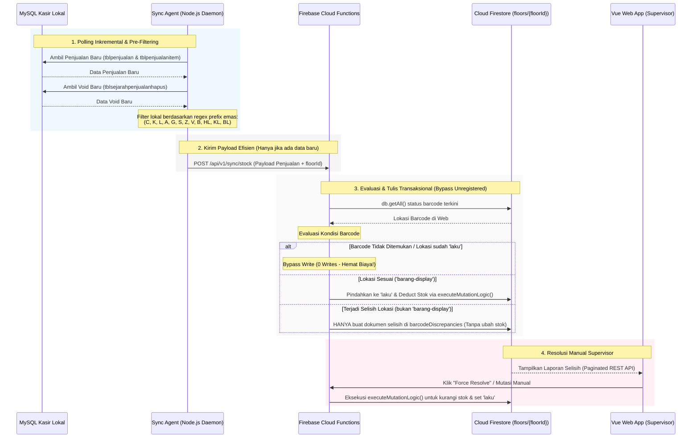

# Product Requirement Document (PRD) & Firebase Optimization Plan
## Integrasi Data & Rekonsiliasi Selisih Stok Multi-Lantai (Desktop MySQL & Web Firestore)
**Melati Gold Shop**

---

### 1. DOKUMEN KONTROL & EXECUTIVE SUMMARY

| Detail | Deskripsi |
| :--- | :--- |
| **Nama Fitur / Modul** | Modul Sinkronisasi & Rekonsiliasi Selisih Stok Multi-Lantai (Multi-Floor Stock Discrepancy Reconciliation) |
| **Status Dokumen** | Updated (Revisi 3 - Hemat Biaya & Terintegrasi Codebase) |
| **Klien / Instansi** | Melati Gold Shop |
| **Target Tech Stack** | Node.js (Sync Agent), Cloud Functions (Backend Firebase), Firestore (NoSQL Database), Vue 3 (Frontend) |

#### Executive Summary
Melati Gold Shop mengoperasikan dua database penjualan terpisah berdasarkan lantai toko fisik:
* **Lantai 1 (Melati Bawah):** Menggunakan database `core_dbtokomasmelatibawah` dengan rata-rata penjualan **450 pcs/hari**. Mapped ke Floor ID `L1` pada Firestore.
* **Lantai 2 (Melati Atas):** Menggunakan database `core_dbtokomasmelatiatas` dengan rata-rata penjualan **300 pcs/hari**. Mapped ke Floor ID `L2` pada Firestore.

Di sisi web, pelacakan mutasi barang dikelola secara terpisah untuk masing-masing lantai (*floor-based*). Sinkronisasi otomatis diperlukan agar penjualan di kasir desktop MySQL langsung meng-update status barcode di Firestore. Masalah timbul jika terjadi selisih (mismatch) lokasi barang antara fisik/kasir dengan data mutasi di web.

Dokumen ini mendefinisikan arsitektur untuk menyinkronkan data penjualan dan pembatalan (void) dari database lokal, mendeteksi selisih secara aman (tanpa kalkulasi otomatis pada data yang tidak valid lokasinya), serta meminimalkan biaya operasi read/write Firestore secara ekstrem.

---

### 2. STRUKTUR FOLDER & BERKAS INTEGRASI

Berikut adalah rencana pemetaan berkas yang dimodifikasi atau dibuat untuk mengintegrasikan fitur ini:

```
melati-app-vue/
├── sync-agent/
│   ├── PRD_Stock_Sync.md (Dokumen PRD ini)
│   └── sync-agent-inventory.js (Modifikasi: Tambah pre-filtering prefix & deteksi void dari MySQL)
├── functions/
│   └── index.js (Modifikasi: Tambah HTTPS Endpoint baru 'syncDesktopSales' & 'syncDesktopVoid')
└── src/
    ├── services/
    │   └── inventory-service.js (Modifikasi: Tambah fungsi fetch & resolve discrepancy)
    ├── components/
    │   └── inventory/
    │       └── barcode-tracking/
    │           └── DiscrepancyDashboard.vue [NEW] (Komponen dashboard daftar selisih & resolusi manual)
    └── views/
        └── inventory/
            └── ManajemenStokView.vue (Modifikasi: Tambah tab baru "Laporan Selisih" untuk Supervisor)
```

---

### 3. ALUR DATA & ARSITEKTUR INTEGRASI MULTI-LANTAI

Sistem dirancang sepenuhnya *floor-scoped* untuk menjaga isolasi data dan performa keamanan rules Firestore. 



---

### 4. STRUKTUR DATABASE & SKEMA FIRESTORE

#### A. Koleksi Dokumen Barcode
Path: `floors/{floorId}/barcodes/{barcodeId}`
```typescript
interface BarcodeDocument {
  barcode: string;             // Kode barcode asli (misal: GM-57154)
  category: string;            // Kategori (CINCIN, KALUNG, dll.)
  detailType: string | null;   // Sub-type (warna/kadar, misal: HIJAU, KA)
  location: string;            // Lokasi (barang-display, brankas, laku, mutasi, dll.)
  in_display: boolean;         // true jika location === 'barang-display'
  in_mutasi: boolean;          // true jika location adalah 'mutasi' atau 'laku'
  lastUpdated: admin.firestore.Timestamp;
}
```

#### B. Koleksi Laporan Selisih (Discrepancy)
Path: `floors/{floorId}/barcodeDiscrepancies/{discrepancyId}`
* ID Dokumen: `DISC_[barcode]_[desktop_item_id]`
```typescript
interface BarcodeDiscrepancyDocument {
  id: string;
  barcode: string;
  invoice_no: string;
  tanggalPenjualan: admin.firestore.Timestamp;
  namaSales: string;
  webLocation: string;         // Lokasi saat selisih terdeteksi (misal: 'brankas' atau 'admin')
  detectedAt: admin.firestore.Timestamp;
  resolved: boolean;
  resolvedAt: admin.firestore.Timestamp | null;
  resolvedBy: string | null;
  resolutionNote: string | null;
}
```

---

### 5. RENCANA OPTIMALISASI SUMBER DAYA & BIAYA FIREBASE

#### PILAR 1: Pre-Filtering Regex Barcode (Optimasi Panggilan & Reads)
Sync Agent menyaring data sebelum mengirim HTTP POST ke Cloud Functions. Kode non-emas atau jasa reparasi diabaikan secara lokal.
* **Implementasi di Sync Agent:**
  ```javascript
  const GOLD_PREFIX_REGEX = /^(C|K|L|A|G|S|Z|V|B|HL|KL|BL)/i;
  
  const validRows = rows.filter(row => GOLD_PREFIX_REGEX.test(row.kode_barcode));
  if (validRows.length === 0) {
      console.log(`[SYNC INFO] Tidak ada transaksi emas baru. Sinkronisasi diabaikan.`);
      return; 
  }
  ```

#### PILAR 2: Zero-Payload Suppression
* HTTP POST ke Cloud Functions dibatalkan jika `validRows.length === 0`.

#### PILAR 3: Batch Reads via `db.getAll()`
* Cloud Function memproses hingga 100 barcode dalam satu batch menggunakan `db.getAll()` untuk meminimalkan beban komputasi server.

#### PILAR 4: State-Comparison & Write Bypass
* Jika barcode **tidak ditemukan di Firestore**, sistem langsung mengabaikannya tanpa menulis apa pun (**Bypass**).
* Jika barcode **sudah berstatus laku (`location === 'laku'`)**, sistem mengabaikannya (0 Writes).
* Jika barcode **mengalami selisih**, sistem hanya menulis satu dokumen di `barcodeDiscrepancies` tanpa menyentuh master stok.

#### PILAR 5: Otentikasi Keamanan Web API (Security Gate)
* Karena endpoint Cloud Function `/syncDesktopSales` adalah URL HTTPS publik, untuk mencegah pengiriman data palsu atau tidak sah oleh pihak luar:
  * Sync Agent wajib menyertakan header `x-api-key` dengan token rahasia (misal: `MelatiSecretToken123`) di setiap request Axios.
  * Cloud Function memverifikasi header tersebut sebelum memproses data. Jika token tidak cocok, server mengembalikan status `403 Forbidden` (menghemat operasi database/reads).

---

### 6. EDGE CASES, RISIKO, DAN MITIGASI MULTI-LANTAI

| No | Skenario Ekstrem (Edge Cases) | Dampak Risiko | Mitigasi Teknis (Best Practice) |
| :--- | :--- | :--- | :--- |
| **1** | Barcode terjual di kasir, tetapi di web terdaftar di lokasi Brankas/Admin. | Terjadi selisih stok jika web otomatis memotong display, padahal barang terdaftar di brankas. | **No Automatic Deduction on Mismatch:** Cloud Function tidak melakukan kalkulasi stok otomatis atau pemindahan lokasi. Hanya laporan discrepancy yang dibuat. Supervisor harus memindahkan lokasi barang secara manual di web baru menyelesaikannya. |
| **2** | Barcode terjual di kasir, tetapi barcode tersebut tidak terdaftar sama sekali di Firestore. | Mengakibatkan penulisan dokumen discrepancy sampah (non-emas/jasa) yang membengkakkan tagihan. | **Bypass & Pre-filtering:** Sync Agent melakukan penyaringan prefix emas secara lokal di desktop. Jika barcode tidak lolos filter, abaikan. Jika lolos filter kasir namun tetap tidak ada di Firestore (karena kelalaian input), Cloud Function mengabaikannya secara total (Bypass, 0 Writes) demi menjaga performa kuota cloud. |
| **3** | Pembatalan Transaksi Penjualan (*Transaction Void*) oleh Supervisor kasir. | Status barang di Firestore telanjur diubah menjadi `'laku'`, membuat jumlah stok fisik di web berkurang permanen padahal barang tidak jadi terjual. | **Void Event Monitoring:** Sync Agent memantau tabel log penghapusan transaksi desktop harian (`tblsejarahpenjualanhapus`) menggunakan watermark. Jika ada void, kirim sinyal ke Cloud Function untuk membaca log mutasi terakhir barcode tersebut di `barcodeMutationLogs`, lalu kembalikan statusnya ke lokasi asal (`location` sebelum terjual) dan naikkan kembali jumlah stok fisiknya secara transaksional. |
| **4** | Koneksi Internet Putus di salah satu lantai selama jam operasional sibuk. | Penjualan desktop terus berjalan, status web tertunda, dan terjadi antrean data transaksi yang menumpuk. | **Smart Watermark & Max-Batch Limit:** Sync Agent menggunakan berkas watermark lokal (`last_sync_state_inventory_L1.json`). Saat internet pulih, kirim secara bertahap maksimal 100 item per request API untuk menghindari kegagalan *timeout* Cloud Functions. |

---

### 7. RENCANA VERIFIKASI (TESTING PLAN)

1. **Uji Kasus Normal (Match):**
   * Pastikan barcode `CM-12345` memiliki lokasi `'barang-display'` di Firestore `floors/L1/barcodes`.
   * Simulasikan penjualan di desktop MySQL untuk `CM-12345`.
   * *Hasil:* Dokumen barcode di Firestore berubah ke lokasi `'laku'`, stok `'barang-display'` berkurang `1`, dan log mutasi tercatat otomatis.
2. **Uji Kasus Selisih Lokasi (Mismatch):**
   * Daftarkan barcode `KM-54321` di lokasi `'brankas'` pada Firestore.
   * Simulasikan penjualan di desktop.
   * *Hasil:* Stok brankas **TIDAK berkurang**, status barcode tetap `'brankas'`, dan satu dokumen laporan dibuat di `floors/L1/barcodeDiscrepancies` dengan `webLocation: 'brankas'`.
3. **Uji Kasus Barcode Tidak Terdaftar (Bypass):**
   * Simulasikan penjualan barcode emas baru yang tidak ada di Firestore.
   * *Hasil:* Server memproses dan langsung mengabaikannya. Log audit Google Cloud menunjukkan **0 Writes** pada database Firestore.
4. **Uji Kasus Void Penjualan:**
   * Hapus/void salah satu transaksi penjualan emas yang sudah berhasil disinkronkan di kasir desktop.
   * *Hasil:* Sync Agent mendeteksi baris baru di `tblsejarahpenjualanhapus`, Cloud Function melacak log mutasi terakhir barang, lalu mengembalikannya ke lokasi asal serta menaikkan kembali stok fisik lokasi tersebut secara transaksional.

---

### 8. ANALISIS KEAMANAN & INTEGRITAS DATA DESKTOP

Menjalankan skrip `sync-agent-inventory.js` di server lokal PC M3200 dijamin **100% aman** dan **tidak akan mengubah, merusak, atau memanipulasi data** pada aplikasi desktop kasir. Berikut adalah pembuktian teknis dan langkah mitigasi terbaiknya:

#### A. Pembuktian Teknis Keamanan Skrip:
1. **Operasi Kueri Read-Only (Hanya SELECT):**
   * Skrip Sync Agent *hanya* menggunakan kueri `SELECT` untuk mengambil data dari tabel `tblpenjualan`, `tblpenjualanitem`, dan `tblsejarahpenjualanhapus`.
   * Skrip **tidak memiliki** perintah tulis seperti `INSERT`, `UPDATE`, `DELETE`, atau `REPLACE` yang menargetkan tabel desktop.
2. **Kueri Terindeks Tanpa Lock (Non-Blocking):**
   * Kueri pencarian data menggunakan operator pencarian primary key terindeks (`Primary > last_id`).
   * MySQL (InnoDB) memproses kueri `SELECT` ini secara non-blocking (*Consistent Non-locking Reads* menggunakan MVCC). Kueri ini tidak mengunci baris maupun tabel, sehingga transaksi kasir di desktop tetap berjalan lancar tanpa risiko *deadlock* atau kelambatan.
   * Waktu eksekusi kueri sangat cepat (di bawah **2 milidetik**), sehingga load CPU database server tetap berada di level normal (< 1%).

#### B. Jaminan Keamanan Kode Tanpa User Role Baru:
Jika Anda ingin langsung menggunakan kredensial database root/admin yang sudah ada di PC M3200 tanpa membuat user baru, data desktop Anda **tetap dijamin aman**. Keamanan ini bersumber dari karakteristik skrip Sync Agent itu sendiri:
1. **Tidak Ada Kode Modifikasi:** Driver MySQL `mysql2` di Node.js hanya akan mengeksekusi sintaks SQL yang ditulis di dalam file skrip. Karena skrip tidak memiliki string perintah `INSERT`, `UPDATE`, `DELETE`, atau `REPLACE` yang menargetkan tabel penjualan, maka perubahan data tidak mungkin terjadi secara tidak sengaja.
2. **Read-Only query flow:** Alur skrip murni berorientasi *pull* (menarik data) untuk dikirimkan ke Firestore (push ke web).

---

### 9. PANDUAN DEPLOYMENT DI PC SERVER M3200 (DAEMON SERVICE - SINGLE CODEBASE, MULTI-INSTANCE)

Karena kedua database lantai (`core_dbtokomasmelatiatas` dan `core_dbtokomasmelatibawah`) berada dalam **satu PC Server M3200**, Anda akan menggunakan pendekatan **Single Codebase, Multi-Instance**. Kita hanya meletakkan **satu file skrip** `sync-agent-inventory.js` di server, lalu menjalankannya sebagai **dua proses terpisah** di PM2 dengan melewatkan argumen lantai (`L1` atau `L2`).

#### Langkah 1: Install Node.js di PC Server M3200
1. Unduh installer **Node.js LTS** (versi 20 atau 22) dari situs resmi [nodejs.org](https://nodejs.org/).
2. Jalankan installer di PC Server M3200 dan ikuti panduan instalasi hingga selesai (centang opsi "Add to PATH").
3. Buka PowerShell atau Command Prompt pada server, lalu jalankan perintah berikut untuk verifikasi:
   ```bash
   node -v
   npm -v
   ```

#### Langkah 2: Persiapkan Folder Project Sync Agent
1. Buat folder baru di server, misalnya di `C:\melati-sync-agent\`.
2. Buka terminal (CMD/PowerShell) di folder tersebut, inisialisasi project, dan install driver MySQL serta HTTP client:
   ```bash
   cd C:\melati-sync-agent
   npm init -y
   npm install mysql2 axios
   ```

#### Langkah 3: Konfigurasi Berkas `sync-agent-inventory.js`
Salin berkas `sync-agent-inventory.js` ke folder `C:\melati-sync-agent\`. Pastikan skrip dirancang untuk menerima argumen baris perintah (*CLI argument*) untuk menentukan target lantai secara dinamis:

* **Sintaks Logika Dinamis di dalam `sync-agent-inventory.js`:**
  ```javascript
  // Membaca argumen lantai dari command line (default ke 'L1' jika tidak diisi)
  const args = process.argv.slice(2);
  const targetFloor = (args[0] || 'L1').toUpperCase();

  // Konfigurasi dinamis berdasarkan parameter input
  const STORE_ID = targetFloor === 'L2' ? 'MELATI-ATAS' : 'MELATI-BAWAH';
  const STATE_FILE = path.join(__dirname, `last_sync_state_inventory_${targetFloor}.json`);
  const VOID_STATE_FILE = path.join(__dirname, `last_sync_void_state_${targetFloor}.json`);

  // URL Endpoint Web (Cloud Function HTTPS baru 'syncDesktopSales')
  const WEBHOOK_URL = 'https://asia-southeast2-<project-id>.cloudfunctions.net/syncDesktopSales';
  const SYNC_API_KEY = 'MelatiSecretToken123'; // Token rahasia otentikasi API

  const DB_CONFIG = {
      host: 'localhost', // Menggunakan localhost karena berada di satu PC Server M3200
      port: 3307,
      user: 'root',
      password: '123',
      database: targetFloor === 'L2' ? 'core_dbtokomasmelatiatas' : 'core_dbtokomasmelatibawah',
      insecureAuth: true
  };
  ```

#### Langkah 4: Jalankan Kedua Instance menggunakan PM2
Untuk menjalankan kedua instance secara terisolasi (Lantai 1 dan Lantai 2) pada background komputer M3200:

1. Install PM2 secara global di server:
   ```bash
   npm install pm2 -g
   ```
2. Jalankan instance Lantai 1 (Bawah) dengan melewatkan argumen `L1` setelah tanda `--`:
   ```bash
   pm2 start sync-agent-inventory.cjs --name "melati-sync-bawah" -- L1
   ```
3. Jalankan instance Lantai 2 (Atas) dengan melewatkan argumen `L2` setelah tanda `--`:
   ```bash
   pm2 start sync-agent-inventory.cjs --name "melati-sync-atas" -- L2
   ```
4. Pastikan kedua proses berjalan aktif dan berstatus `online`:
   ```bash
   pm2 status
   ```
5. Agar PM2 dan kedua instance otomatis berjalan saat Windows Server M3200 booting/restart, ikuti langkah-langkah **Windows Task Scheduler** berikut:
   * **Simpan State PM2 Terkini:**
     Jalankan perintah berikut di PowerShell/CMD untuk menyimpan daftar proses aktif saat ini:
     ```bash
     pm2 save
     ```
   * **Buka Task Scheduler:**
     Tekan `Win + R`, ketik `taskschd.msc`, lalu tekan **Enter**.
   * **Buat Tugas Baru (Create Basic Task):**
     1. Di panel *Actions* sebelah kanan, klik **Create Basic Task...**
     2. Beri nama tugas, misalnya: `PM2 Resurrect on Startup`
     3. Klik *Next*.
   * **Atur Trigger:**
     1. Pilih **When the computer starts** (agar berjalan saat Windows booting sebelum user login).
     2. Klik *Next*.
   * **Atur Action:**
     1. Pilih **Start a program**.
     2. Klik *Next*.
     3. Pada kolom **Program/script**, isi dengan: `cmd.exe`
     4. Pada kolom **Add arguments (optional)**, isi dengan: `/c %APPDATA%\npm\pm2.cmd resurrect`
     5. Klik *Next*, lalu klik *Finish*.
   * **Pengaturan Tambahan (Properties Penting):**
     1. Cari tugas `PM2 Resurrect on Startup` yang baru dibuat di daftar tengah, klik kanan, lalu pilih **Properties**.
     2. Pada tab **General**:
        * Pilih opsi **Run whether user is logged on or not** (agar script tetap jalan meskipun tidak ada user kasir yang login).
        * Centang opsi **Run with highest privileges** (menghindari hambatan izin administrator).
     3. Pada tab **Settings**:
        * Hapus centang pada **Stop the task if it runs longer than: 3 days** (agar PM2 tidak dihentikan paksa setelah 3 hari berjalan).
     4. Klik **OK**, lalu masukkan password user Windows Server jika diminta.

6. Untuk memantau log aktivitas sinkronisasi masing-masing instance:
   * Log Lantai 1: `pm2 logs "melati-sync-bawah"`
   * Log Lantai 2: `pm2 logs "melati-sync-atas"`
